# 🎓 Learning Platform - Complete Workflow Flowchart

## 📊 **Main Application Flow**

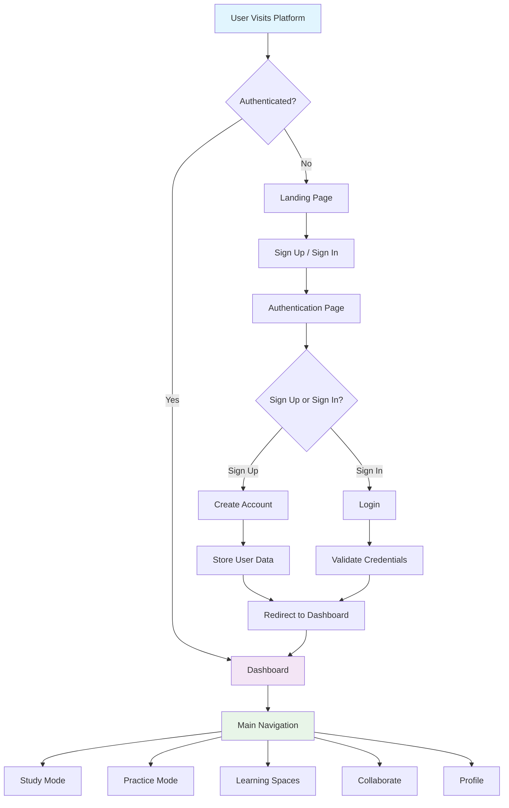

## 📚 **Study Mode Flow**

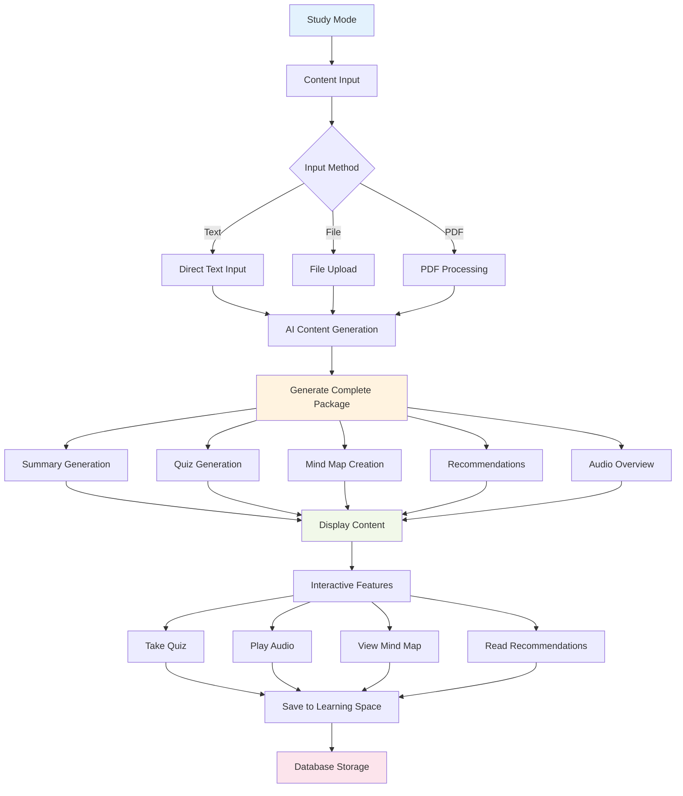

## 🎯 **Practice Mode Flow**

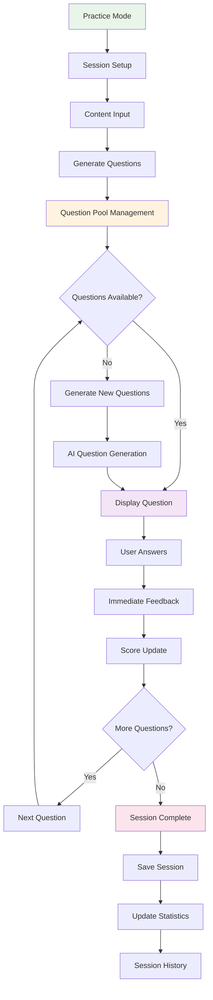

## 📖 **Learning Spaces Flow**

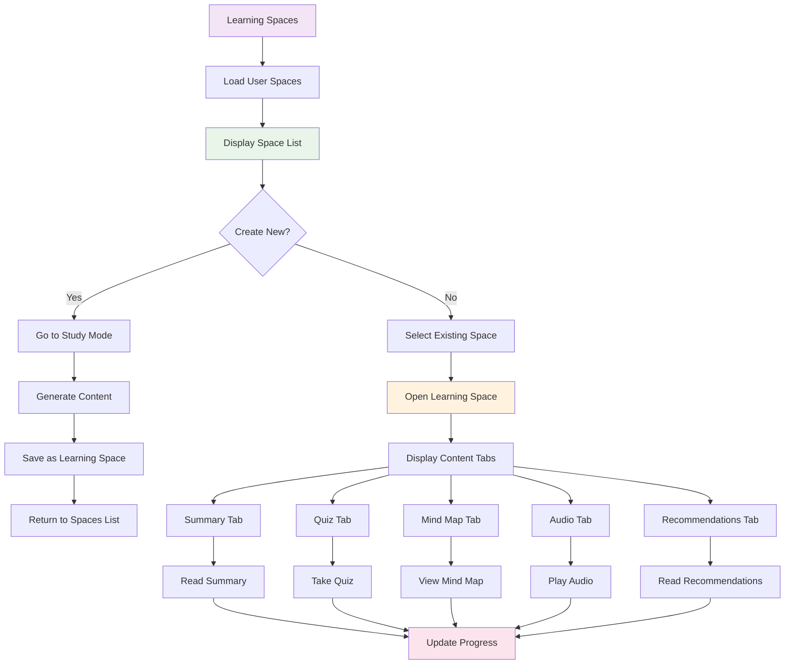

## 👥 **Collaboration Flow**

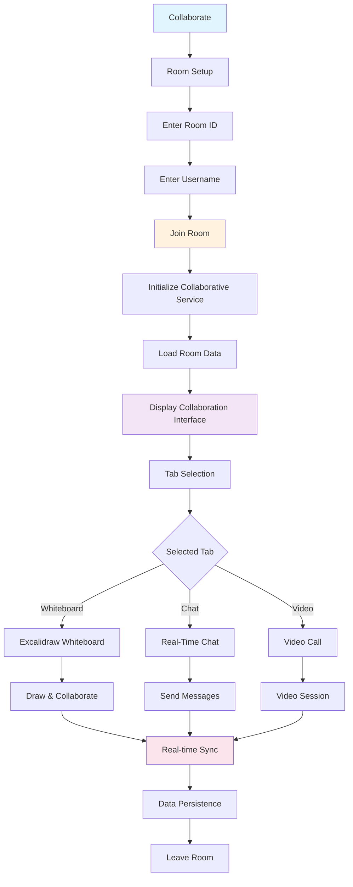

## 🔐 **Authentication & Profile Flow**

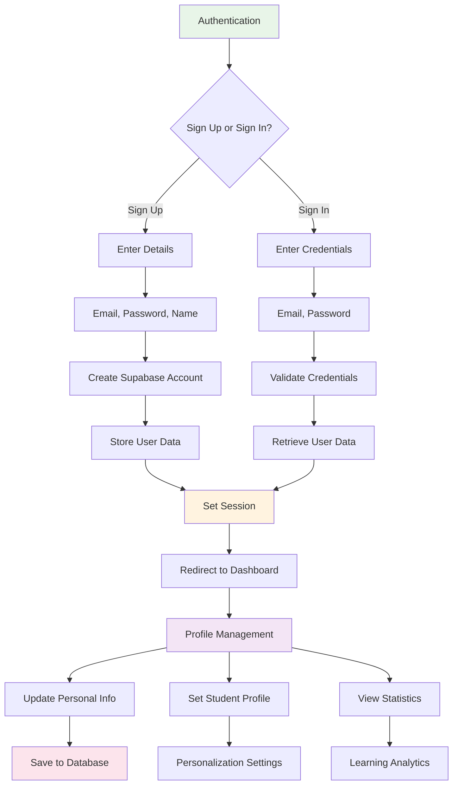

## 🤖 **AI Content Generation Flow**

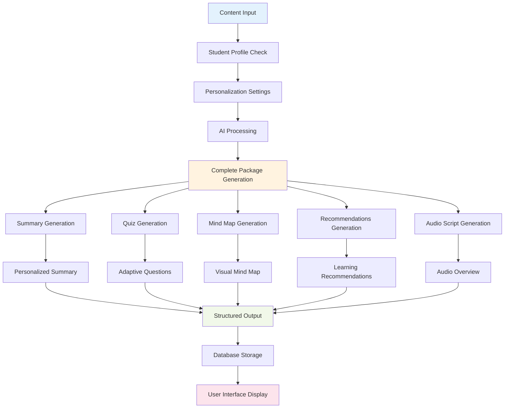

## 💾 **Database & API Flow**

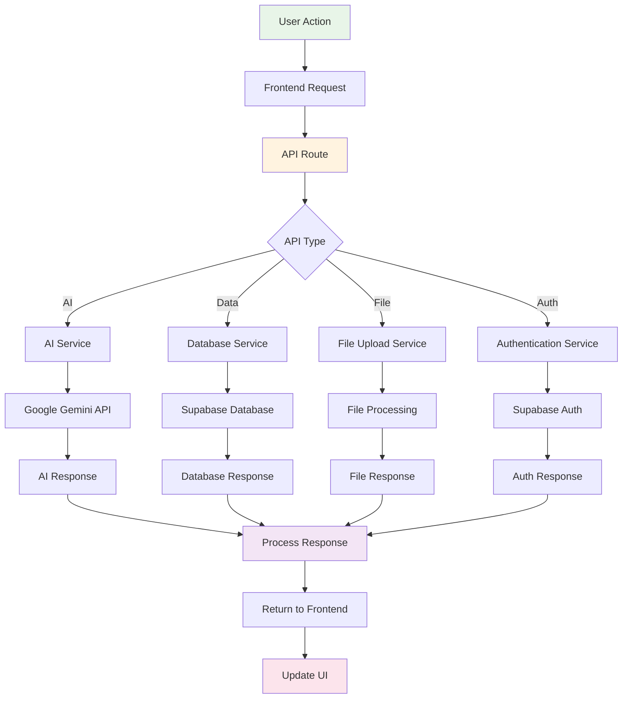

## 📊 **Data Flow Architecture**

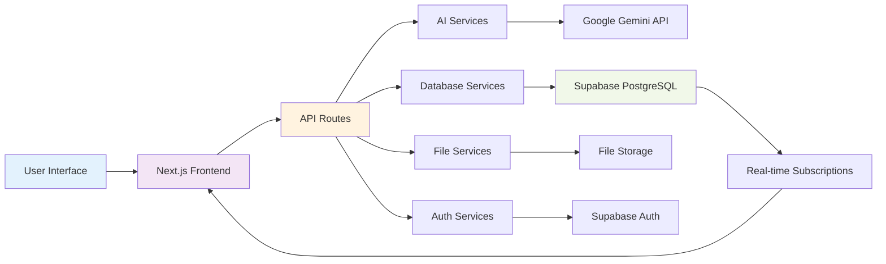

## 🎨 **User Interface Components**

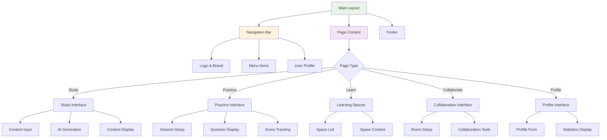

## 🔄 **Real-time Collaboration Flow**

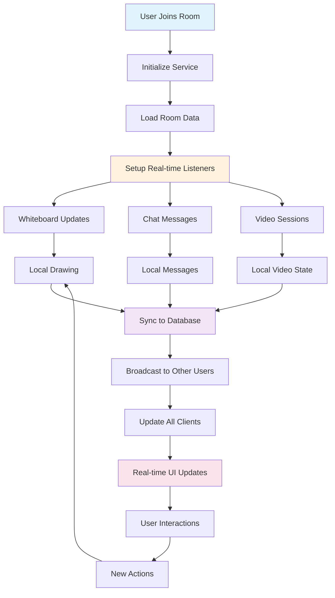

---

## 📋 **Key Features Summary**

### **🎯 Core Features**
- ✅ **AI-Powered Content Generation**
- ✅ **Interactive Practice Sessions**
- ✅ **Learning Space Management**
- ✅ **Real-time Collaboration**
- ✅ **Personalized Learning**
- ✅ **Progress Tracking**

### **🔧 Technical Features**
- ✅ **Authentication & Authorization**
- ✅ **Database Persistence**
- ✅ **Real-time Updates**
- ✅ **File Upload & Processing**
- ✅ **Responsive Design**
- ✅ **API Integration**

### **📊 Data Flow**
- ✅ **User Input → AI Processing → Content Generation → Storage → Display**
- ✅ **Real-time Collaboration → Database → Broadcast → UI Updates**
- ✅ **Authentication → Session Management → Route Protection**

This flowchart provides a complete visual representation of your learning platform's workflow, showing how all components interact and how data flows through the system! 🎓✨
